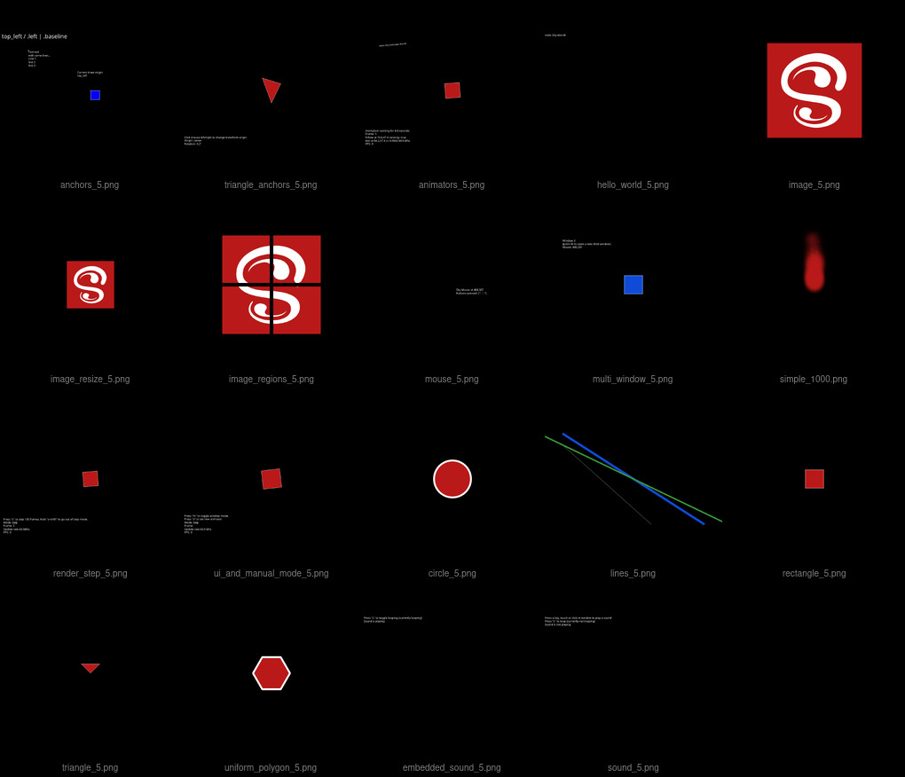
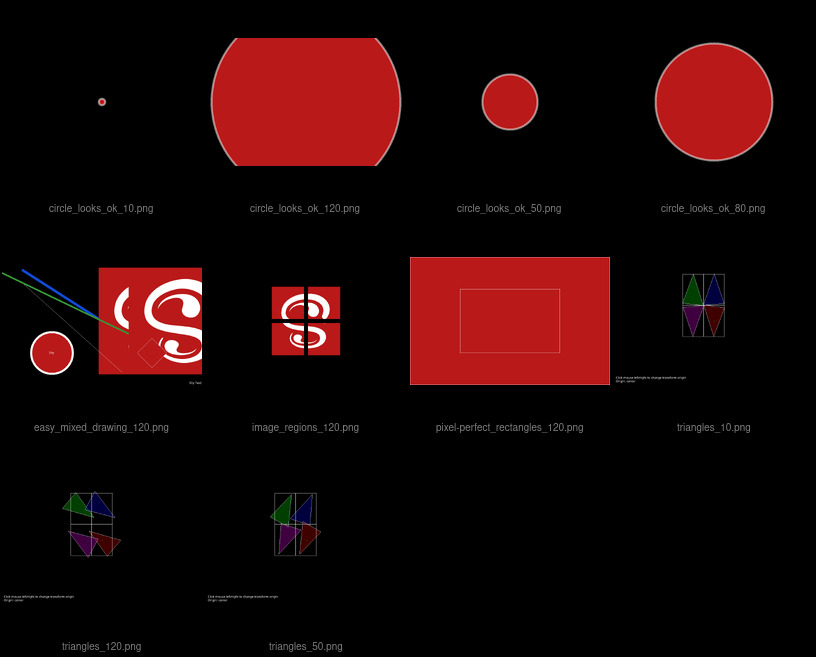

# Reference images for Shy visual tests

This repository contains reference images for visual tests that can be performed in [Shy](https://github.com/larpon/shy).

The images were generated with the following setup:

To match the CI as much as possible the images are currently generated in an
Ubuntu 22.04 virtual box machine, locally, to match the output of the software rasterizer driver
used in GitHubs CI.

```bash
export DISPLAY=:99 && export LIBGL_ALWAYS_SOFTWARE=true
Xvfb :99 -dpi 96 -screen 0 960x614x24 &
```

Then, from the root of this directory:
```bash
v gret -r $HOME/.vmodules/shy -t vgret.shy_examples.toml -v /tmp/shy-visual-tests
v gret -r $HOME/.vmodules/shy -t vgret.shy_visual_tests.toml -v /tmp/shy-visual-tests
```

Testing against a freshly captured set use:

```bash
v gret -r $HOME/.vmodules/shy -t vgret.shy_examples.toml -v /tmp/shy-visual-tests ./
v gret -r $HOME/.vmodules/shy -t vgret.shy_visual_tests.toml -v /tmp/shy-visual-tests ./
```



